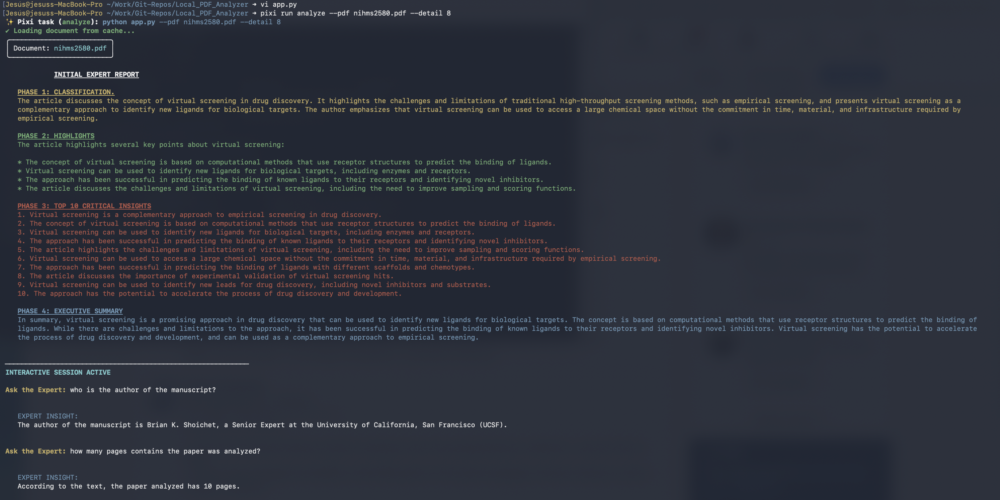

# Senior Expert PDF Analyzer (Optimized CLI Version)

 

An advanced CLI terminal-based AI assistant designed to extract, analyze, and discuss PDF documents with high technical rigor. This tool is built for professionals who require deep document intelligence without compromising data privacy.

## 🚀 Core Purpose & Local Advantage
The primary function of this assistant is to serve as a **Senior Expert Panel**. Unlike cloud-based solutions, this tool is **fully optimized to run locally** on your machine.

* **100% Local Execution:** By leveraging **Ollama**, all data processing and AI inference happen on your hardware.
* **Security & Confidentiality:** Your sensitive documents never leave your local environment. There are no external API calls to third-party providers, ensuring total data sovereignty.
* **CLI Optimized:** Purpose-built for speed and efficiency via the command line.

> **Note:** While this version is optimized for the Command Line Interface (CLI), a web-browser version is currently under development to provide a graphical interface in the future.

---

## 🛠 Integrated Features

### 1. Intelligent Pickle Caching
To ensure maximum performance, the script implements a **Pickle-based caching system**.
* **High-Speed Reloading:** The first time a PDF is analyzed, the script performs a deep extraction and sanitizes the content.
* **Persistence:** It saves the processed data into a `.pkl` file. Subsequent runs load this data instantly, bypassing the extraction phase for immediate interaction.

### 2. Table-Aware & Image-Strict Extraction
The tool employs a sophisticated extraction logic to handle complex document layouts:
* **Table Preservation:** Uses spatial block-sorting to maintain the logical flow of rows and columns, allowing the AI to interpret data structures and financial tables accurately.
* **Object Filtering:** The engine explicitly ignores images and non-text graphics. This reduces noise, saves context tokens, and focuses the AI purely on the textual and tabular intelligence of the file.

### 3. Structured Phase Analysis & Interactive Session
The assistant organizes its findings into four distinct expert phases, each designed to provide a specific layer of document intelligence:

* **PHASE 1: CLASSIFICATION** – Strategic identification of the document type, domain, and intent.
* **PHASE 2: HIGHLIGHTS** – A comprehensive summary of key themes and structural pillars.
* **PHASE 3: TOP 10 CRITICAL INSIGHTS** – Extraction of the most vital technical, legal, or financial points.
* **PHASE 4: EXECUTIVE SUMMARY** – A high-level final verdict for decision-makers.

**Interactive Expert Loop:**
Following the initial report, the tool opens a continuous interactive session. It maintains full context memory of the document.

---

## 📋 Environment & Installation

### 1. Local AI Engine (Ollama)
This tool requires **Ollama** to run the LLM locally.
1. Download Ollama from [ollama.com](https://ollama.com).
2. Install the Llama 3 model by running:
   `ollama pull llama3`

### 2. Environment Management (Pixi)
The project is configured with a `pixi.toml` file for reproducible environments.
1. Install **Pixi** from [pixi.sh](https://pixi.sh).
2. To set up the environment:
   `pixi install`

---

## 💻 Usage

The project includes a **Pixi Task alias** for faster execution. You can use the `analyze` shortcut:

`pixi run analyze --pdf <path_to_pdf> --detail <1-10>`

*(This alias maps to: `python app.py` as defined in pixi.toml)*

**Parameters:**
* `--pdf`: (Required) Path to the PDF file you want to analyze.
* `--detail`: (Optional) Level of depth for the report, from 1 to 10 (Default: 5).

**Interactive Session Commands:**
* **Ask anything:** Just type your question about the document and press Enter.
* **clear**: Resets the chat history memory.
* **exit / quit**: Safely closes the session.

**Output:**
* The initial report is automatically saved to a file named `summary.md` in the root directory.
